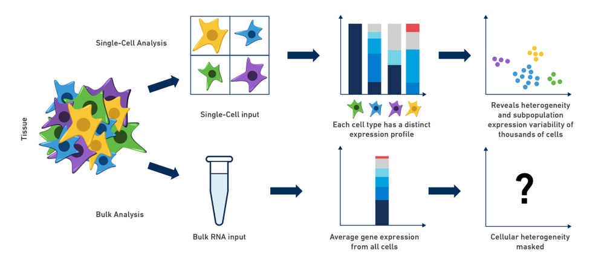
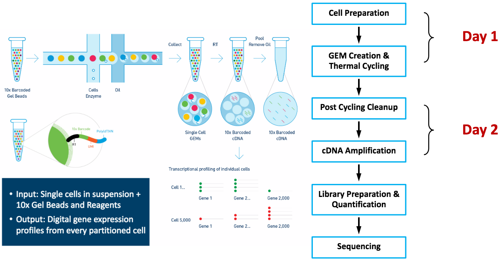
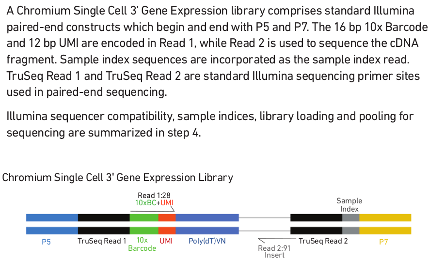

```{r setup, include=FALSE}
library(knitr)
knitr::opts_chunk$set(echo = TRUE)
```
## Why single-cell genomics?
```{r bulk_vs_single-cell, fig.align="center", echo=FALSE, out.width = "85%", fig.cap = 'Fig1. Single-cell RNA-seq reveals cellular heterogeneity that is masked by bulk RNA-seq methods.'}

```
- The traditional bulk RNA-seq methods: grind and find!
- To observe the cell diversity and heterogenity
- To study the development of a sub-population of cells
- intra-tumor difference
- to characterize the immune cell population
- [Ref1](https://www.10xgenomics.com/blog/single-cell-rna-seq-an-introductory-overview-and-tools-for-getting-started)

## 10x Genomics' single-cell RNA-seq (scRNA-seq)
```{r chromium_workflow, fig.align="center", echo=FALSE, out.width = "85%", fig.cap = 'Fig2. 10x Genomics Chromium Workflow.'}

```
- Scalable transcriptional profiling of 1000 to 10,000 of individual cells
- When 8,000 cells loaded with a multiple rate 3.9%, 5,000 cells to be recovered
- When 12,800 cells loaded with a multiple rate 6.1%, 8,000 cells to be recovered
- [Ref1](https://assets.ctfassets.net/an68im79xiti/1eX2FPdpeCgnCJtw4fj9Hx/7cb84edaa9eca04b607f9193162994de/CG000204_ChromiumNextGEMSingleCell3_v3.1_Rev_D.pdf)
- [Ref2](https://www.youtube.com/watch?v=Z2yCozcwHNk&t=33s)

## Sequencing
```{r 3prime expression lib, fig.align="center", echo=FALSE, out.width = "85%", fig.cap = "Fig3. 10x Genomics Chromium Single Cell 3' Gene Expression Library"}

```