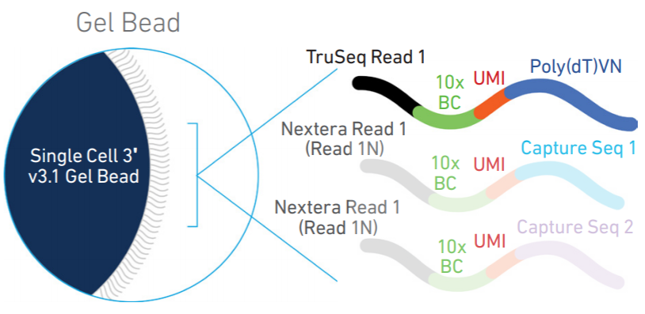
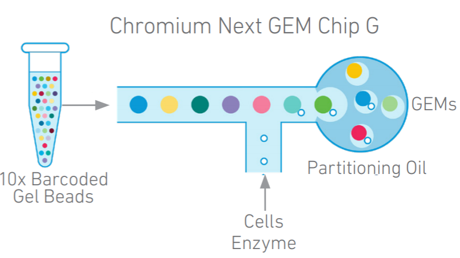
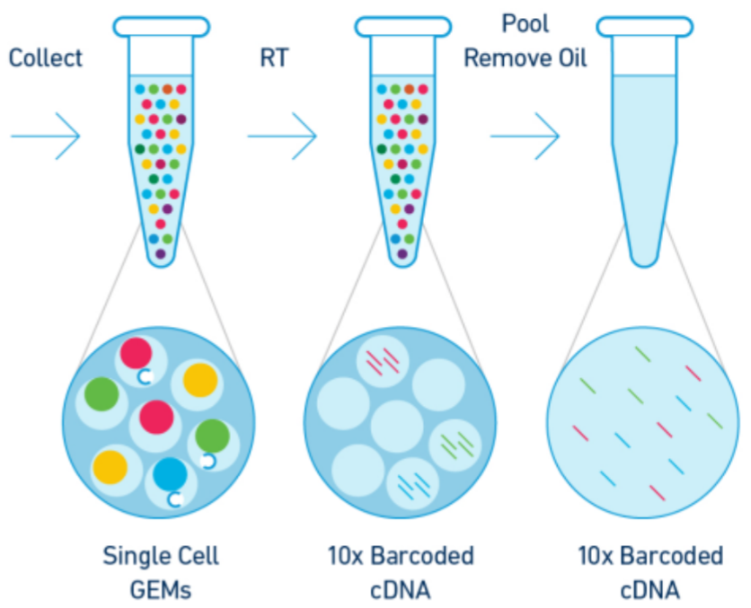

```{r setup, include=FALSE}
library(knitr)
opts_chunk$set(echo = TRUE)
```
### The Benefits of single-cell sequencing
```{r bulk_vs_single-cell, fig.align="center", echo=FALSE, out.width = "85%", fig.cap = 'Fig1. Single-cell RNA-seq reveals cellular heterogeneity that is masked by bulk RNA-seq methods.'}
include_graphics("media/sc_benefits.png")
```
- explore which cell types are present in a tissue
- identify unknown/rare cell types or states
- elucidate the changes in gene expression during differentiation processes or across time or states
- identify genes that are differentially expressed in particular cell types between conditions (e.g. treatment or disease)
- explore changes in expression among a cell type while incorporating spatial, regulatory, and/or protein information
- [Ref1](https://www.10xgenomics.com/blog/single-cell-rna-seq-an-introductory-overview-and-tools-for-getting-started)
- [Ref2](https://github.com/hbctraining/scRNA-seq/blob/master/lessons/01_intro_to_scRNA-seq.md)

### Challenges of scRNA-seq analysis
Despite scRNA-seq being able to capture expression at the cellular level, sample generation and library preparation is more expensive and the analysis is much more complicated and more difficult to interpret. The complexity of analysis of scRNA-seq data involves:

- Large volume of data
- Low depth of sequencing per cell
- Technical variability across cells/samples
- Biological variability across cells/samples

```{r sc_bio_Var, fig.align="center", echo=FALSE, out.width = "85%", fig.cap = 'Fig2. [Wagner, A, et al. Revealing the vectors of cellular identity with single-cell genomics, Nat Biotechnol. 2016](doi:https://dx.doi.org/10.1038%2Fnbt.3711)'}
include_graphics("media/sc_biol_variability.png")
```

### Technical variability across cells/samples
- Technical sources of variation can result in gene expression between cells being more similar/different based on technical sources instead of biological cell types/states, which can obscure the cell type identities. Technical sources of variation include:

- Cell-specific capture efficiency: Different cells will have differing numbers of transcripts captured resulting in differences in sequencing depth (e.g. 10-50% of transcriptome).

- Library quality: Degraded RNA, low viability/dying cells, lots of free floating RNA, poorly dissociated cells, and inaccurate quantitation of cells can result in low quality metrics

- Amplification bias: During the amplification step of library preparation, not all transcripts are amplified to the same level.

- Batch effects: Batch effects are a significant issue for scRNA-Seq analyses, since you can see significant differences in expression due solely to the batch effect.

- DO split replicates of the different sample groups across batches. The more replicates the better (definitely more than 2), if doing DE across conditions or making conclusions at the population level.

```{r recom_expdesign, fig.align="center", echo=FALSE, out.width = "85%", fig.cap = 'Fig3. Suggested experiments from Hicks SC, et al., bioRxiv (2015)'}
include_graphics("media/batch_effect.png")
```

- DO include batch information in your experimental metadata. During the analysis, we can regress out the variation due to batch so it doesn't affect our results if we have that information.


### 10x Genomics' single-cell RNA-seq (scRNA-seq)
#### Gel-in bead
```{r gel_bead, fig.align="center", echo=FALSE, out.width = "85%", fig.cap = "Fig4. 10x Genomics  single cell 3' gel bead"}

```
- Poly(dT)-primer
- Two additional primers for feature bardcoding to recognize cell-surface proteins
- cell barcode and UMI

#### GEMs
```{r gem_chip, fig.align="center", echo=FALSE, out.width = "85%", fig.cap = "Fig5. 10x Genomics Chromium Next GEM Chip G"}

```
- Nanoliter-scale Gel Beads-in-emulsion (GEMs)
- The majority (~90-99%) of generated GEMs contain no cell
- Scalable transcriptional profiling of 1,000 to 10,000 of individual cells

#### The number of cells to capture
```{r cell_stats, fig.align="center", echo=FALSE, out.width = "85%", fig.cap = "Fig6. 10x Genomics Chromium Next GEM Chip G"}

```
- Up to 80,000+ cells per run
- When 8,000 cells loaded with a multiple rate 3.9%, 5,000 cells to be recovered
- When 12,800 cells loaded with a multiple rate 6.1%, 8,000 cells to be recovered

#### Sequencing
```{r 3p_sequencing, fig.align="center", echo=FALSE, out.width = "85%", fig.cap = "Fig7. 10x Genomics Chromium Single Cell 3' Gene Expression Library"}
include_graphics("media/10x_chromium_r1_r2.png")
```
- [Ref1](https://assets.ctfassets.net/an68im79xiti/1eX2FPdpeCgnCJtw4fj9Hx/7cb84edaa9eca04b607f9193162994de/CG000204_ChromiumNextGEMSingleCell3_v3.1_Rev_D.pdf)
- [Ref2](https://www.youtube.com/watch?v=Z2yCozcwHNk&t=33s)

### Things to know
- Why single-cell sequencing is useful?
- The number of cells in 3' scRNA-seq
- What information is stored in R1 and R2, respectively?