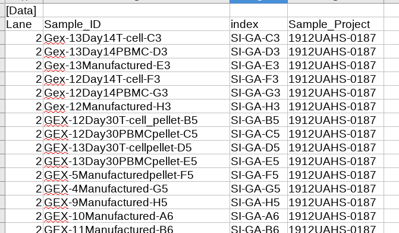
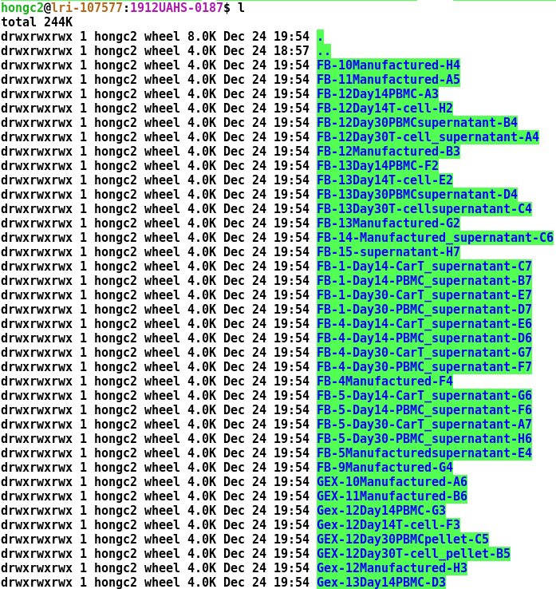
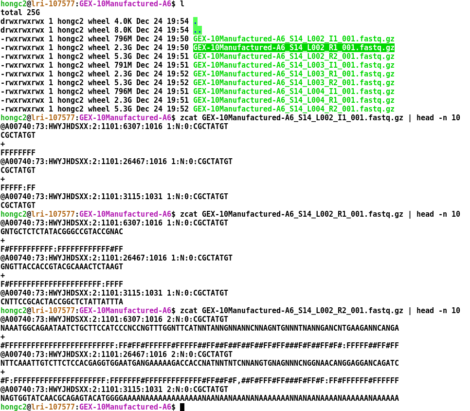

```{r setup, include=FALSE, code_folding=TRUE}
library(knitr)
opts_chunk$set(echo = TRUE)
```

## BCL to FASTQ conversion
- Sample sheet
```{r sample_sheet, fig.align="center", echo=FALSE, out.width = "60%", fig.cap = 'Fig1. A sample worksheet used in sequencing in 10x Genomics Chromium platform'}

```

- We need to convert the Illumina sequencer's base call (BCL) files to FASTQ file format. 10x Genomics provides a software called cellranger. For instance, we can run
````markdown
cellranger mkfastq --id=${run_id} --run=${bcl_folder} --csv=${sample_worksheet_used_in_sequencing}
````
- The output generates 3 folders that includes FASTQ file folder, Reports, and Stats folders.

- [ref:cellranger.mkfastq](https://support.10xgenomics.com/single-cell-gene-expression/software/pipelines/latest/using/mkfastq)

- Demultiplexing: In general, more than one samples are loaded into multiple flowcell and the conversion process recognizes sample barcodes and group them into a same sample.

- How the FASTQ files are look like?
After mkfastq run, sample folders defined in the input sample sheet are created and each sample folder has FASTQ files.

```{r bcl2fastq_output, fig.align="center", echo=FALSE, out.width = "60%", fig.cap = 'Fig2. Demultiplexed samples after mkfastq run'}

```

## 10x Genomics FASTQ files

- FASTQ file format: Three files form a group. I1 contains a sample barcode, R1 contains cell-barcode and UMI, and R2 is an actual cDNA read.

```{r 10x_fastq_file, fig.align="center", echo=FALSE, out.width = "85%", fig.cap = 'Fig3. 10x Genomics FASTQ file format'}

```
- **What is a sequence header?**
- **How many lines form one short read?**
- **What is "F:FFFFFFFF#..."?**
- [ref: FASTQ file format](https://en.wikipedia.org/wiki/FASTQ_format)
- [ref: Fastqc](https://www.bioinformatics.babraham.ac.uk/projects/fastqc/)
