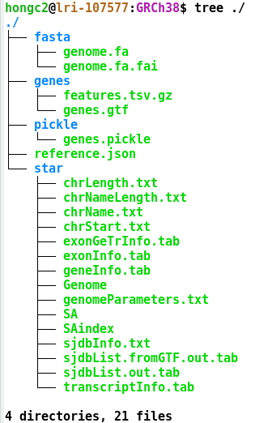
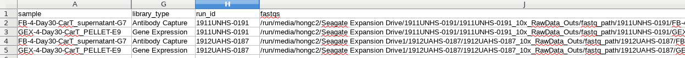
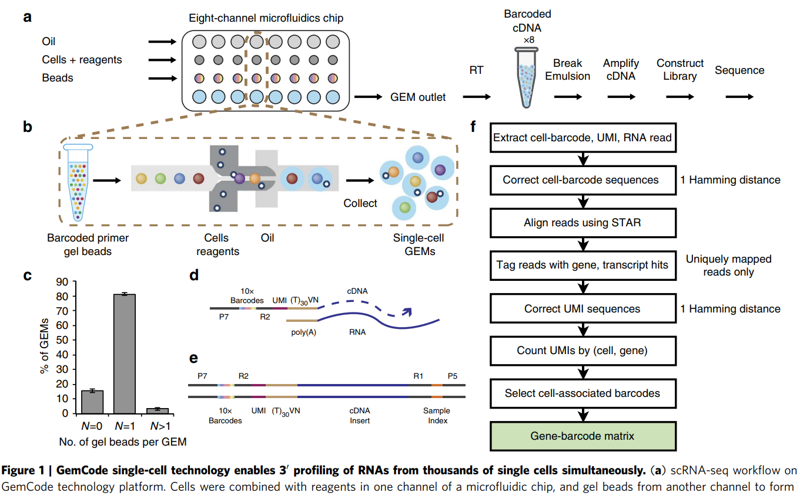
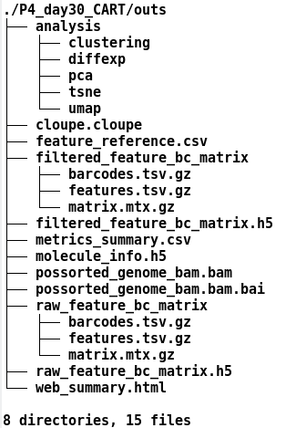

```{r setup, include=FALSE, code_folding=TRUE}
library(knitr)
opts_chunk$set(echo = TRUE)
```

## Preparing inputs
- FASTQ file path: refer to `01_bcl_to_fatq.Rmd`
- reference/transcriptome filepath: Given a reference genome sequence in FASTA file and gene model annotation file, we build index files to speed up an alignment procedure. The cellranger count utilizes `STAR` RNA-Seq alignment method. Use `cellranger mkgtf`
- [ref:cellranger.mkgtf](https://support.10xgenomics.com/single-cell-gene-expression/software/pipelines/latest/advanced/references)

```{r sample_sheet, fig.align="center", echo=FALSE, out.width = "50%", fig.cap = 'Fig1. Many pre-built transcriptome index files are available from online for the ones often used. We can build our own index files for the species of interest using `cellranger mkgtf`'}

```
- `genes.gtf`: GTF file format gene model file

## FASTQ to BAM
- For example,
````markdown
cellranger count --id P4_day30_CART
	--transcriptome=~/ref/10x_genomics/GRCh38
	--libraries=~/projects/cart/1911UNHS-0191_1912UAHS-0187_count/P4.day30.CART.csv
	--feature-ref=~/projects/cart/1912UAHS-0187/doc/lymphoma_fr_20191213.csv
	--localcores=12
	--localmem=96
````
- `P4_day30_CART`: unique sample ID user can assign
- `~/ref/10x_genomics/GRCh38`: transcriptome index directory path
- `libraries`: For multiple FASTQ file paths belonging to the sample ID, create a CSV file that has three fields: `fastqs` (fastq file directory), `sample` (filename to search for in the fastq directory), and `library_type`.

```{r count_library_csv, fig.align="center", echo=FALSE, out.width = "100%", fig.cap = 'Fig2. A library sample sheet to run cellranger count. In this example, one GEM was sequenced in two times. Both `Gene expression` and `Antibody Capture` are used in the library_type.'}

```

## Cellranger count workflow overview
```{r count_workflow_overview, fig.align="center", echo=FALSE, out.width = "80%", fig.cap = 'Fig4. Excerpted from Zheng et. al. "https://www.nature.com/articles/ncomms14049.pdf"'}

```
## Output files
```{r count_output_files, fig.align="center", echo=FALSE, out.width = "50%", fig.cap = 'Fig5. The cellranger count generates QC summary statistics, STAR BAM file, feature by cell matrix, and low dimension clustering analysis.'}

```
## Interpreting the results
Here, we only examine the feature count/mapping quality.
- [web_summary.html](media/web_summary.html)
