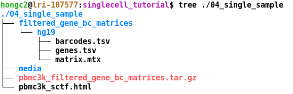

```{r setup, include=FALSE}
library(knitr)
opts_chunk$set(echo = TRUE, eval = TRUE, include=TRUE)
```
Note that this tutorial is borrowed from [Seurat website](https://satijalab.org/seurat/pbmc3k_tutorial.html), compiled on Jan 9, 2020.

### Setup the Seurat Object
For this tutorial, we will be analyzing the dataset of Peripheral Blood Mononuclear Cells (PBMC) freely available from 10X Genomics. 2,700 single cells were sequenced on the Illumina NextSeq 500.

***
*Task: Find the zip file, `filtered_gene_bc_matrices.zip` at the working directory and unzip the file ("Extract Here"). For example, the extracted files location should be like this,*
<details>
  <summary>where files should be located?</summary>
```{r sample_sheet, fig.align="center", out.width = "60%", eval=TRUE, fig.cap = 'Fig1. cellranger count output files in your current directory'}

```
</details>

***

We start by reading in the data. The `Read10X` function reads in the output of the [cellranger](https://support.10xgenomics.com/single-cell-gene-expression/software/pipelines/latest/what-is-cell-ranger) pipeline from 10X, returning a unique molecular identifier (UMI) count matrix. The values in this matrix represent the number of molecules for each feature (i.e. gene; row) that are detected in each cell (column).

We next use the count matrix to create a `Seurat` object. The object serves as a container that contains both data (like the count matrix) and analysis (like PCA, or clustering results) for a single-cell dataset. For a technical discussion of the `Seurat` object structure, check out our GitHub Wiki. For example, the count matrix is stored in pbmc[["RNA"]]@counts.

Load R libraries necessary in the script,
```{r load_libs}
library(dplyr)
library(Seurat)
library(ggplot2)
```

Read Cellranger count output files we downloaded above and create a Seurat object,
```{r 10x_to_seurat}
# The directory is generated from 10x Genomics cellranger count. The directory should contain 3 files: barcodes.tsv, genes.tsv, and matrix.mtx. The output will be a sparse matrix (dgCMatrix).
pbmc.data <- Read10X(data.dir = "filtered_gene_bc_matrices/hg19")

# Initialize the Seurat object with the raw (non-normalized data).
# Consider genes that appear into at least 3 cells and cells that express a minimum 100 unique genes
pbmc <- CreateSeuratObject(counts = pbmc.data, project = "pbmc3k", min.cells = 3, min.features = 100)
dim(pbmc)
```

***

*Task: Explore the Seurat object pbmc just created and what does the object look like?*
<details>
  <summary>Answer</summary>
```{r explore_s4}
class(pbmc)
getSlots("Seurat")
str(pbmc)
```
</details>

***

### Standard pre-processing workflow
The steps below encompass the standard pre-processing workflow for scRNA-seq data in Seurat. These represent the selection and filtration of cells based on QC metrics, data normalization, and scaling, and the detection of highly variable features.

#### QC and selecting cells for further analysis
Seurat allows you to easily explore QC metrics and filter cells based on any user-defined criteria. A few QC metrics [commonly used](https://www.ncbi.nlm.nih.gov/pmc/articles/PMC4758103/) by the community include

- The number of unique genes detected in each cell.
    - Low-quality cells or empty droplets will often have very few genes.
    - Cell doublets or multiplets may exhibit an aberrantly high gene count.
- Similarly, the total number of molecules detected within a cell (correlates strongly with unique genes).
- The percentage of reads that map to the mitochondrial genome
    - Low-quality / dying cells often exhibit extensive mitochondrial contamination.
    - We calculate mitochondrial QC metrics with the `PercentageFeatureSet` function, which calculates the percentage of counts originating from a set of features.
    - We use the set of all genes starting with MT- as a set of mitochondrial genes.

```{r pct.mt}
# The [[ operator can add columns to object metadata. This is a great place to stash QC stats
pbmc[["percent.mt"]] <- PercentageFeatureSet(pbmc, pattern = "^MT-")
```

From the feature count matrix, the object collects some useful metrics and store them into a slot, meta.data.

```{r meta.data}
head(pbmc@meta.data)
```

In the example below, we visualize QC metrics, and use these to filter cells. Plot the distribution of the number of features, read counts, and percentage of the mitochondria.

```{r before.qc.violin}
# Visualize QC metrics as a violin plot before QC
VlnPlot(pbmc, features = c("nFeature_RNA", "nCount_RNA", "percent.mt"), ncol = 3, pt.size=0)
```

By examining the violin plots, we perform QC. We filter cells that have unique feature counts over 2,500 or less than 200. We filter cells that have >5% mitochondrial counts.
```{r after.qc.violin}
pbmc <- subset(pbmc, subset = nFeature_RNA > 200 & nFeature_RNA < 2500 & percent.mt < 5)

# Visualize QC metrics as a violin plot after QC
VlnPlot(pbmc, features = c("nFeature_RNA", "nCount_RNA", "percent.mt"), ncol = 3, pt.size=0)

# FeatureScatter is typically used to visualize feature-feature relationships but can be used
# for anything calculated by the object, i.e. columns in object metadata, PC scores etc.

plot1 <- FeatureScatter(pbmc, feature1 = "nCount_RNA", feature2 = "percent.mt") + theme(legend.position = 'none')
plot2 <- FeatureScatter(pbmc, feature1 = "nCount_RNA", feature2 = "nFeature_RNA") + theme(legend.position = 'none')
CombinePlots(plots = list(plot1, plot2))
```

### Normalization and scaling data
Each cell has a different sequencing depth due to either technical variation or biological variation. <ins>Sequencing depth is highly correlated with UMI count but it is also varied depending on each gene</ins>. In general, we employ a global-scaling normalization method "LogNormalize" that normalizes the feature expression measurements for each cell by the total expression, multiplies this by a scale factor (10,000 by default), and log-transforms the result.

### Identification of highly variable features (feature selection)
The number of genes (features) is over 20,000. After normalization, many gene abundance values are nearly similar across the cells. We want to select a subset of genes highly variable across the cells. In general, the normalized read count is z-transformed and select genes with top-K highest variance.

### SCTransform: Three steps at once
The three steps above are performed by `SCTransform`. The sctransform calculates a model of technical noise in scRNA-seq data using 'regularized negative binomial regression'. The residuals for this model are normalized values and can be positive or negative. Positive residuals for a given gene in a given cell indicate that we observed more UMIs than expected given the gene's average expression in the population and cellular sequencing depth, while negative residuals indicate the converse.

```{r sctf, warning=FALSE}
# run sctransform
pbmc <- SCTransform(pbmc, vars.to.regress = "percent.mt", verbose = FALSE)
```

The results of sctransfrom are stored in the 'SCT' assay. The assay has 3 slots: `pbmc[['SCT']]@counts`, `pbmc[['SCT']]@data`, and  `pbmc[['SCT']]@scale.data`.

- `pbmc[['SCT']]@scale.data` contains the residuals (normalized values), and is used directly as input to <ins>PCA (i.e., dimensional reduction)</ins>. Please note that this matrix is non-sparse, and can, therefore, take up a lot of memory if stored for all genes. To save memory, we store these values only for variable genes, by setting the `return.only.var.genes = TRUE` by default in the SCTransform function call.

- The 'corrected' UMI counts are stored in `pbmc[['SCT']]@counts` which is adjusted by the Pearson residuals. This data is often used for <ins>a differential gene expression testing</ins>.

- We store log-normalized versions of these corrected counts in `pbmc[['SCT']]@data`, which are very helpful for <ins>a visualization of differential expression</ins>.

You can save the object at this point so that it can easily be loaded back in without having to rerun the computationally intensive steps performed above, or easily shared with collaborators.
```{r r.save}
save(pbmc,file='filtered_gene_bc_matrices/hg19/01_pbmc3k_sctf.rd',compress=TRUE)
```

### You should know
- Seurat object structure
- QC
- Normalization
- Save R environment variables